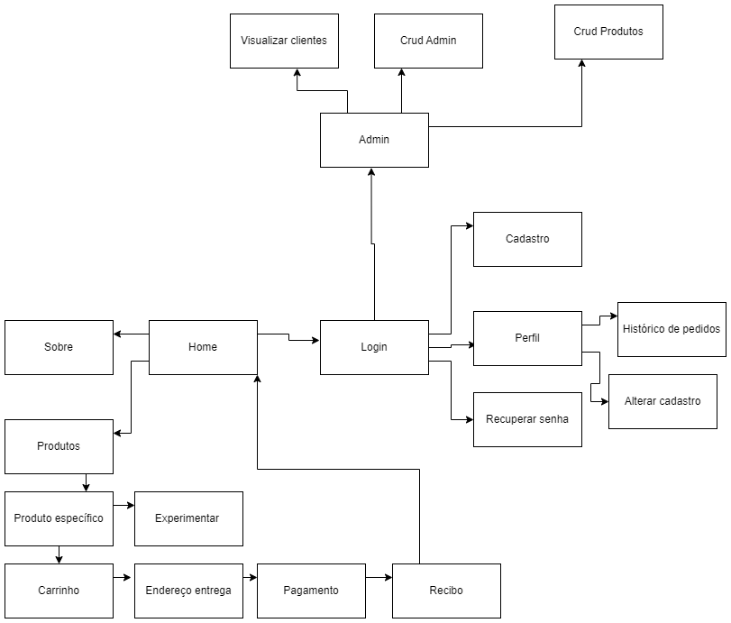

# Fresh Rice

Projeto desenvolvido para disciplina SCC0219 - Introdução ao Desenvolvimento Web.

### Alunos:
*  **Rafael Sartori Vantin** - 12543353
*  **Renato Tadeu Theodoro Junior** - 11796750
*  **Fábio Verardino de Oliveira** - 12674547

## Introdução

A Fresh Rice começou como uma ótica fundada na Alemanha em 1978 que, com o tempo, se tornou uma franquia de ótica internacional e após muitos pedidos, irá lançar seu próprio ecommerce.

Agora, com o lançamento do nosso ecommerce, a Fresh Rice quer levar a experiência única de compra de óculos para o conforto da sua casa. Com uma vasta seleção de óculos de sol e de grau das melhores marcas, você pode navegar pelo nosso site facilmente e encontrar o par perfeito para você. Nós também oferecemos lentes de alta qualidade para garantir que você tenha a melhor visão possível. Não perca a oportunidade de comprar seus óculos com a Fresh Rice e experimentar o que há de melhor em qualidade e conveniência.

## 1. Requirements

### Usuário
#### Tela inicial
- A tela contará com um botão para redirecionar para a área de login.
- Contará com barra de busca para filtrar produtos.
- Contará com link para página de perfil (requer autenticação).
- Contará com link para página de produtos.
- Contará com link pro carrinho (requer autenticação).
- Contará com link para página sobre.
- Contará com imagens decorativas.  

#### Login
- Contará com botão pra registrar-se que irá redirecionar para página de cadastro.
- Contará com dois inputs (login e senha)
- Contará com um botão para logar.
- Contará com uma opção de esqueci senha.
- Após login irá redirecionar para a tela inicial.

#### Página de cadastro
- Irá conter os seguintes inputs:
  - Nome
  - Email
  - Data de nascimento
  - CPF
  - Endereço
  - Senha
  - Confirmar senha
- Irá conter um botão para cadastro
- Após o cadastro bem sucedido irá redirecionar para a tela inicial
- O Id é gerado automaticamente
#### Tela de Produtos
- Irá conter uma lista de todos os produtos
- Irá conter os seguintes filtros:
  - Preço
  - Cor
  - Material da Lente
- Será carregado 6 óculos por vez, podendo carregar mais
#### Produto específico
- Essa página é a paginá especifica do produto
- Irá conter uma foto do produto
- Irá conter a descrição
- Irá conter o preço
- Poderá selecionar a quantidade de óculos
- Poderá adicionar ao carrinho  
 -Caso adiciona uma quantidade maior que disponível será disparado uma mensagem de erro  
- Poderá experimentar o óculos, isto é, sua webcam será aberta e uma imagem do óculos estara na tela para experimetnar.   
#### Página carrinho
 - Irá conter lista dos produtos adicionados 
 - Opção para prosseguir com o pagamento
 - Preço total
 #### Página pagamento
 - Irá conter inputs para adicionar os dados do cartão:
  - Número do cartão
  - Nome no cartão
  - Data de vencimento
  - Código de segurança
 - Botão para realizar pagamento
 #### Página Recibo
 - Essa página irá conter resumidamente as informações do pedido
 #### Menu perfil
 - Esse menu se localizará no canto superior esquerdo, substituindo o botão de Login, após um usuário entrar com sua conta.
 - Se tratará de um menu dropdown com 3 opções:
   - Link para página que irá permitr as alterações de informações, execeto email. Senha somente com a confirmação da senha atual
   - Link para o histórico de pedidos do cliente.
   - Botão para realizar logout.
 #### Página histórico
 - Irá conter todos os pedidos realizados pelo cliente
 #### Página sobre
 - Página com um texto sobre a empresa
 ### Admin
 #### Página login
 - Contará com dois inputs (login e senha)
 - Contará com um botão para logar.
 - Após o login irá redirecionar para uma pagina admin
 #### Página admin
 - Irá conter três botões:
  - Gerenciar cliente
  - Gerenciar produtos
  - Gerenciar administradores
 #### Gerenciar cliente
 - Irá conter uma lista de clientes cadastrados
 #### Gerenciar produtos
 - Irá conter os seguintes botões:
  - Cadastrar novos produtos
  - Alterar Produtos
  - Visualizar produtos
 #### Página cadastro produtos
 - Irá conter os seguintes inputs:
  - Nome
  - Preço
  - Descrição
  - Material Lente
  - Cor
  - Imagem
  - Quantidade
 - Irá conter um botão para salvar essas informações
 - Após isso irá aparecer uma mensagem, caso houve sucesso ou falha
 - O Id é gerado automaticamente
 ##### Página alterar produto
 - Irá conter uma barra de pesquisa para digitar o id do produto
 - Após a busca com sucesso será possível alterar as informações do produto ou excluir o produto
  ##### Página Listar produto
 - Será possível visualizar em lista todos os produtos
 - Ao clicar num produto será redirecionado para a página de alterar produto
#### Gerenciar admin
- Crud admin
## 2. Project description

> Clique [aqui](https://encurtador.com.br/iJKQ6) para acessar o link do figma.

### Diagrama de navegação:
> [Clique aqui](https://www.figma.com/proto/0Z40o9PE301GszwxYBSKAF/Ecommerce-Wireframe-Kit-(Community)?type=design&node-id=1-11654&scaling=min-zoom&page-id=0%3A1&starting-point-node-id=1%3A11654&show-proto-sidebar=1) para visualizar o a sequência esperada do usuário   
> 
> [Clique aqui](https://www.figma.com/proto/0Z40o9PE301GszwxYBSKAF/Ecommerce-Wireframe-Kit-(Community)?type=design&node-id=592-926&scaling=min-zoom&page-id=0%3A1&starting-point-node-id=592%3A926&show-proto-sidebar=1) para visualizar a sequência esperada do admin.
>  

## 3. Comments about the code

## 4. Test plan

### Usuário
#### Tela Inicial
Verificar se o link para a página de perfil está redirecionando corretamente e somente quando o usuário estiver autenticado.
Verificar se o link para a página "sobre" está funcionando corretamente.
#### Login
Verificar se é exibida uma mensagem de erro caso as credenciais informadas estejam incorretas.
Verificar se é possível recuperar a senha através da opção "esqueci senha".
#### Página de Cadastro
Verificar se é exibida uma mensagem de erro caso as informações fornecidas sejam inválidas ou já existam na base de dados.
#### Tela de Produtos
Verificar se os filtros de preço, cor e material de lente estão funcionando corretamente.
Verificar se é possível carregar mais produtos além dos 6 que são carregados inicialmente.
#### Produto Específico
Verificar se é possível selecionar a quantidade de óculos e adicionar ao carrinho com sucesso.
Verificar se é exibida uma mensagem de erro caso a quantidade de óculos selecionada seja maior que a quantidade disponível em estoque.
Verificar se é possível experimentar o óculos através da webcam.
#### Página Carrinho
Verificar se é possível prosseguir com o pagamento clicando no botão correspondente.
Verificar se o preço total está sendo exibido corretamente.

## 5. Test results

## 6. Build procedures

## 7. Problems

## 8. Comments
