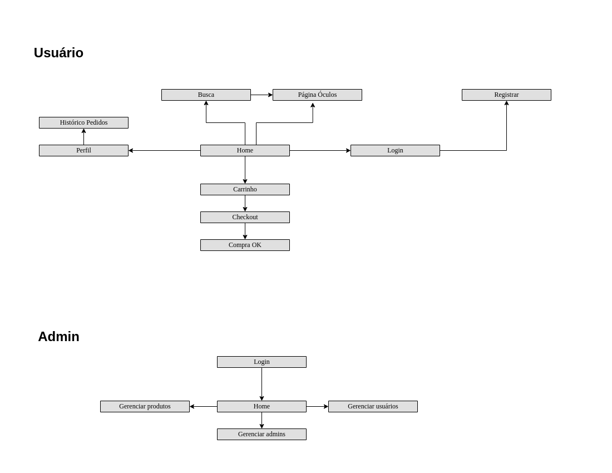

# Fresh Rice

Projeto desenvolvido para disciplina SCC0219 - Introdução ao Desenvolvimento Web.

### Alunos:
*  **Rafael Sartori Vantin** - 12543353
*  **Renato Tadeu Theodoro Junior** - 11796750
*  **Fábio Verardino de Oliveira** - 12674547

## Introdução

A Fresh Rice começou como uma ótica fundada na Alemanha em 1978 que, com o tempo, se tornou uma franquia de ótica internacional e após muitos pedidos, irá lançar seu próprio ecommerce.

Agora, com o lançamento do nosso ecommerce, a Fresh Rice quer levar a experiência única de compra de óculos para o conforto da sua casa. Com uma vasta seleção de óculos de sol e de grau das melhores marcas, você pode navegar pelo nosso site facilmente e encontrar o par perfeito para você. Nós também oferecemos lentes de alta qualidade para garantir que você tenha a melhor visão possível. Não perca a oportunidade de comprar seus óculos com a Fresh Rice e experimentar o que há de melhor em qualidade e conveniência.

## 1. Requirements

### Usuário
#### Tela inicial
- A tela contará com um botão para redirecionar para a área de login.
- Contará com barra de busca para filtrar produtos.
- Contará com link para página de perfil (requer autenticação).
- Contará com link para página de produtos.
- Contará com link pro carrinho (requer autenticação).
- Contará com link para página sobre.
- Contará com imagens decorativas.  

### Login
- Contará com botão pra registrar-se que irá redirecionar para página de cadastro.
- Contará com dois inputs (login e senha)
- Contará com um botão para logar.
- Contará com uma opção de esqueci senha.
- Após login irá redirecionar para a tela inicial.

### Página de cadastro
- Irá conter os seguintes inputs:
  - Nome
  - Email
  - Data de nascimento
  - CPF
  - Endereço
  - Senha
  - Confirmar senha
- Irá conter um botão para cadastro
- Após o cadastro bem sucedido irá redirecionar para a tela inicial 
## 2. Project description

> Clique [aqui](https://encurtador.com.br/iJKQ6) para acessar o link do figma.

### Diagrama de navegação:

## 3. Comments about the code

## 4. Test plan

## 5. Test results

## 6. Build procedures

## 7. Problems

## 8. Comments
